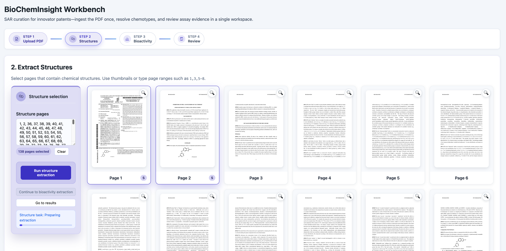

# BioChemInsight 🧪

**BioChemInsight** is a powerful platform that automates the extraction of chemical structures and their corresponding bioactivity data from scientific literature. By leveraging deep learning for image recognition and OCR, it streamlines the creation of high-quality, structured datasets for cheminformatics, machine learning, and drug discovery research.



## Features 🎉

  * **Automated Data Extraction** 🔍: Automatically identifies and extracts compound structures and biological activity data (e.g., IC50, EC50, Ki) from PDF documents.
  * **Advanced Recognition Core** 🧠: Utilizes state-of-the-art DECIMER Segmentation models for image analysis and PaddleOCR for robust text recognition.
  * **dots_ocr as OCR Engine** 🆕: For significantly improved OCR performance, you can use `dots_ocr` as the OCR engine. Please refer to `DOCKER_DOTS_OCR/README.md` for setup and configuration. Note: Running `dots_ocr` on an RTX 5090 GPU requires approximately 30GB of VRAM.
  * **Recommended Visual Model**: For the visual model, it is recommended to use **GLM-V4.5** for optimal results.
  * **Multiple SMILES Engines** ⚙️: Offers seamless switching between **MolScribe**, **MolVec**, and **MolNexTR** to convert chemical diagrams into SMILES strings.
  * **Flexible Page Selection** 📄: Process specific, non-continuous pages (e.g., "1-3, 5, 7-9, 12"), saving time and computational resources.
  * **Structured Data Output** 🛠️: Converts unstructured text and images into analysis-ready formats like CSV and Excel.
  * **Modern Web UI** 🌐: A React-based frontend with FastAPI backend for intuitive PDF processing, real-time progress tracking, and interactive result visualization.
  * **Intelligent Data Merging** 🔗: Automatically merges structure and bioactivity data based on compound IDs, providing seamless integrated results.


## Applications 🌟

  * **AI/ML Model Training**: Generate high-quality datasets for training predictive models in cheminformatics and bioinformatics.
  * **Drug Discovery**: Accelerate structure-activity relationship (SAR) studies and lead compound optimization.
  * **Automated Literature Mining**: Drastically reduce the manual effort and time required for curating data from scientific articles.


## Workflow 🚀

BioChemInsight employs a multi-stage pipeline to convert raw PDFs into structured data:

1.  **PDF Preprocessing**: The input PDF is split into individual pages, which are then converted into high-resolution images for analysis.
2.  **Structure Detection**: **DECIMER Segmentation** scans the images to locate and isolate chemical structure diagrams.
3.  **SMILES Conversion**: The selected recognition engine (**MolScribe**, **MolVec**, or **MolNexTR**) converts the isolated diagrams into machine-readable SMILES strings.
4.  **Identifier Recognition**: A visual model (recommended: **GLM-V4.5**) recognizes the compound identifiers (e.g., "Compound **1**", "**2a**") associated with each structure.
5.  **Bioactivity Extraction**: **PaddleOCR** (or `dots_ocr` if configured) extracts text from specified assay pages, and large language models help parse and standardize the bioactivity results.
6.  **Data Integration**: All extracted information—compound IDs, SMILES strings, and bioactivity data—is merged into structured files (CSV/Excel) for download and downstream analysis.


## Installation 🔧

#### Step 1: Clone the Repository

```bash
git clone https://github.com/dahuilangda/BioChemInsight
cd BioChemInsight
```

#### Step 2: Configure Constants

The project requires a `constants.py` file for environment variables and paths. A template is provided.

```bash
# Rename the example file
mv constants_example.py constants.py
```

Then, edit `constants.py` to set your API keys, model paths, and other necessary configurations.

#### Step 3: Create and Activate the Conda Environment

```bash
conda install -c conda-forge mamba
mamba create -n chem_ocr python=3.10
conda activate chem_ocr
```

#### Step 4: Install Dependencies

First, install PyTorch with CUDA support.

```bash
# Install CUDA Tools and PyTorch
mamba install -c nvidia -c conda-forge cudatoolkit=11.8
pip install torch torchvision torchaudio --index-url https://download.pytorch.org/whl/cu118 -i https://pypi.tuna.tsinghua.edu.cn/simple
```

Next, install the remaining Python packages.

```bash
# Install core libraries (using a mirror for faster downloads)
pip install decimer-segmentation molscribe -i https://pypi.tuna.tsinghua.edu.cn/simple
mamba install -c conda-forge jupyter pytesseract transformers
pip install PyMuPDF PyPDF2 openai -i https://pypi.tuna.tsinghua.edu.cn/simple

# Install web service dependencies
pip install fastapi uvicorn -i https://pypi.tuna.tsinghua.edu.cn/simple

# Install Node.js and npm (for frontend)
# On Ubuntu/Debian:
curl -fsSL https://deb.nodesource.com/setup_18.x | sudo -E bash -
sudo apt-get install -y nodejs

# On macOS (using homebrew):
# brew install node
```

## Usage 📖

BioChemInsight can be operated via an interactive web interface or directly from the command line.

> **Important:** Start at least one OCR microservice before launching the pipeline. Choose between:
> - `DOCKER_PADDLE_OCR` (recommended) for the PaddleOCR service and set `PADDLEOCR_SERVER_URL` in `constants.py`.
> - `DOCKER_DOTS_OCR` for the DotsOCR service and set `DOTSOCR_SERVER_URL` in `constants.py`.
> You can run both and switch by updating `DEFAULT_OCR_ENGINE`.

### Web Interface 🌐

The modern React-based web interface provides an intuitive platform for processing documents with real-time progress tracking.

#### Launch the Web Service

**Step 1: Start the Backend API Server**

From the project root directory, run:

```bash
uvicorn frontend.backend.main:app --host 0.0.0.0 --port 8000 --reload
```

**Step 2: Start the Frontend Development Server**

In a new terminal, run:

```bash
cd frontend/ui
npm install
NODE_OPTIONS="--max-old-space-size=8196" npm run dev
```

**Step 3: Access the Interface**

Open `http://localhost:5173` in your web browser to access the interface. The backend API will be available at `http://localhost:8000`.


#### Web Interface Features

1.  **PDF Upload**: Upload and manage PDF files through the intuitive interface.
2.  **Visual Page Selection**: Click on page thumbnails to select pages for structure and assay extraction.
3.  **Step-by-Step Processing**: 
    - **Step 1**: Upload PDF and preview pages
    - **Step 2**: Extract chemical structures with real-time progress
    - **Step 3**: Extract bioactivity data with structure-constrained compound matching
    - **Step 4**: Review and download merged results
4.  **Real-time Progress Tracking**: Monitor extraction progress with detailed status updates.
5.  **Interactive Results**: View, edit, and download structured data with integrated compound-activity matching.
6.  **Automatic Data Merging**: Seamlessly combines structure and bioactivity data based on compound IDs.

### Command-Line Interface (CLI)

For batch processing and automation, the CLI is recommended.

#### Enhanced Syntax (Recommended)

The new syntax supports flexible, non-continuous page selections.

```bash
python pipeline.py data/sample.pdf \
    --structure-pages "242-267" \
    --assay-pages "270-272" \
    --assay-names "FRET EC50" \
    --engine molnextr \
    --output output
```

**Flexible Page Selection Examples:**

  * **Extract structures from non-continuous pages:**
    ```bash
    python pipeline.py data/sample.pdf --structure-pages "242-250,255,260-267" --engine molnextr --output output
    ```
  * **Extract multiple assays from scattered pages:**
    ```bash
    python pipeline.py data/sample.pdf --structure-pages "242-267" --assay-pages "30,35,270-272" --assay-names "IC50,FRET EC50" --engine molnextr --output output
    ```

#### Legacy Syntax (Still Supported)

For backward compatibility, the original start/end page syntax remains available.

```bash
python pipeline.py data/sample.pdf \
    --structure-start-page 242 \
    --structure-end-page 267 \
    --assay-start-page 270 \
    --assay-end-page 272 \
    --assay-names "FRET EC50" \
    --engine molnextr \
    --output output
```


## Output 📂

The platform generates the following structured data files in the specified output directory:

  * `structures.csv`: Contains the detected compound identifiers and their corresponding SMILES representations.
  * `assay_data.json`: Stores the raw extracted bioactivity data for each specified assay.
  * `merged.csv`: A combined file that merges chemical structures with their associated bioactivity data.


## Docker Deployment 🐳

Deploy BioChemInsight in a containerized environment for consistency and portability.

#### Step 1: Build the Docker Image

```bash
docker build -t biocheminsight .
```

#### Step 2: Run the Service

**Option A: Launch the Web App (Default)**

Run this command to start both the React frontend and FastAPI backend services.

```bash
docker run --rm -d --gpus all \
    -p 3000:3000 -p 8000:8000 \
    -e http_proxy="" \
    -e https_proxy="" \
    -v $(pwd)/data:/app/data \
    -v $(pwd)/output:/app/output \
    -v $(pwd)/constants.py:/app/constants.py \
    biocheminsight
```

After launching, access the UI by visiting:
- Frontend: `http://localhost:3000`
- Backend API: `http://localhost:8000`

**Option B: Run the Command-Line Pipeline**

If you need to execute a batch job using the CLI, override the default entrypoint by specifying `python pipeline.py` and its arguments after the `docker run` command.

```bash
docker run --rm --gpus all \
    -e http_proxy="" \
    -e https_proxy="" \
    -v $(pwd)/data:/app/data \
    -v $(pwd)/output:/app/output \
    --entrypoint python \
    biocheminsight \
    pipeline.py data/sample.pdf \
    --structure-pages "242-267" \
    --assay-pages "270-272" \
    --assay-names "FRET EC50" \
    --engine molnextr \
    --output output
```

**Option C: Enter the Container for an Interactive Session**

To debug or run commands manually inside the container:

```bash
docker run --gpus all -it --rm \
  --entrypoint /bin/bash \
  -e http_proxy="" \
  -e https_proxy="" \
  -v $(pwd)/data:/app/data \
  -v $(pwd)/output:/app/output \
  --name biocheminsight_container \
  biocheminsight
```
