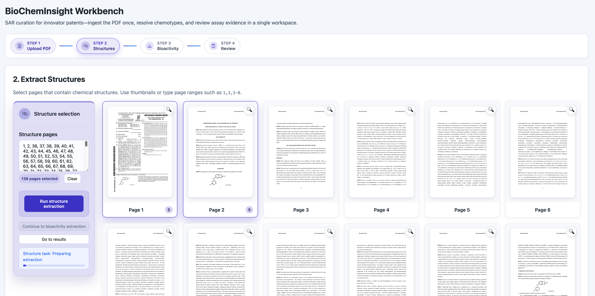

# BioChemInsight 🧪

**BioChemInsight** is a powerful platform that automates the extraction of chemical structures and their corresponding bioactivity data from scientific literature. By leveraging deep learning for image recognition and OCR, it streamlines the creation of high-quality, structured datasets for cheminformatics, machine learning, and drug discovery research.



## Features 🎉

  * **Automated Data Extraction** 🔍: Automatically identifies and extracts compound structures and biological activity data (e.g., IC50, EC50, Ki) from PDF documents.
  * **Advanced Recognition Core** 🧠: Utilizes state-of-the-art DECIMER Segmentation models for image analysis and PaddleOCR for text recognition.
  * **Recommended Visual Model**: For the visual model, it is recommended to use **GLM-V4.5** for optimal results.
  * **Structure Recognition** ⚙️: Uses DECIMER Segmentation plus MolNexTR to convert chemical diagrams into SMILES strings.
  * **Automatic Document Planning** 📄: Detects structure pages, bioactivity pages, and assay names automatically, with optional page ranges for constrained runs.
  * **Structured Data Output** 🛠️: Converts unstructured text and images into analysis-ready formats like CSV and Excel.
  * **Modern Web UI** 🌐: A React-based frontend with FastAPI backend for intuitive PDF processing, real-time progress tracking, and interactive result visualization.
  * **Intelligent Data Merging** 🔗: Automatically merges structure and bioactivity data based on compound IDs, providing seamless integrated results.


## Applications 🌟

  * **AI/ML Model Training**: Generate high-quality datasets for training predictive models in cheminformatics and bioinformatics.
  * **Drug Discovery**: Accelerate structure-activity relationship (SAR) studies and lead compound optimization.
  * **Automated Literature Mining**: Drastically reduce the manual effort and time required for curating data from scientific articles.


## Workflow 🚀

BioChemInsight employs a multi-stage pipeline to convert raw PDFs into structured data:

1.  **PDF Preprocessing**: The input PDF is split into individual pages, which are then converted into high-resolution images for analysis.
2.  **Structure Detection**: **DECIMER Segmentation** scans the images to locate and isolate chemical structure diagrams.
3.  **SMILES Conversion**: MolNexTR converts the isolated diagrams into machine-readable SMILES strings.
4.  **Identifier Recognition**: A visual model (recommended: **GLM-4.5V**) recognizes the compound identifiers (e.g., "Compound **1**", "**2a**") associated with each structure.
5.  **Bioactivity Extraction**: **PaddleOCR** extracts text from detected bioactivity pages, and large language models help parse and standardize the bioactivity results.
6.  **Data Integration**: All extracted information—compound IDs, SMILES strings, and bioactivity data—is merged into structured files (CSV/Excel) for download and downstream analysis.


## Installation 🔧

#### Step 1: Clone the Repository

```bash
git clone https://github.com/dahuilangda/BioChemInsight
cd BioChemInsight
```

#### Step 2: Configure Constants

The project requires a `constants.py` file for environment variables and paths. A template is provided.

```bash
# Rename the example file
mv constants_example.py constants.py
```

Then, edit `constants.py` to set your API keys, model paths, and other necessary configurations.

#### Step 3: Create and Activate the Conda Environment

```bash
conda install -c conda-forge mamba
mamba create -n chem_ocr python=3.10
conda activate chem_ocr
```

#### Step 4: Install Dependencies

First, install PyTorch with CUDA support.

```bash
# Install CUDA Tools and PyTorch
mamba install -c nvidia -c conda-forge cudatoolkit=11.8
pip install torch torchvision --index-url https://download.pytorch.org/whl/cu118 -i https://pypi.tuna.tsinghua.edu.cn/simple
```

Next, install the remaining Python packages.

```bash
# Install core libraries (using a mirror for faster downloads)
pip install SmilesPE opencv-python-headless -i https://pypi.tuna.tsinghua.edu.cn/simple
mamba install -c conda-forge jupyter pytesseract transformers
pip install PyMuPDF PyPDF2 openai Levenshtein mdutils tabulate python-multipart -i https://pypi.tuna.tsinghua.edu.cn/simple

# Install web service dependencies
pip install fastapi uvicorn celery redis -i https://pypi.tuna.tsinghua.edu.cn/simple

# Install Redis server plus Node.js/npm (for the async web UI)
# On Ubuntu/Debian:
sudo apt-get install -y redis-server
curl -fsSL https://deb.nodesource.com/setup_18.x | sudo -E bash -
sudo apt-get install -y nodejs

# On macOS (using homebrew):
# brew install redis node
```

## Usage 📖

BioChemInsight can be operated via an interactive web interface or directly from the command line.

> **Important:** Start the PaddleOCR microservice before launching the pipeline. Use `DOCKER_PADDLE_OCR` and set `PADDLEOCR_SERVER_URL` in `constants.py`.

### Web Interface 🌐

The modern React-based web interface provides an intuitive platform for processing documents with real-time progress tracking.

#### Launch the Web Service Locally

The web UI uses asynchronous jobs. A local development deployment therefore needs **five** running processes:

1. Redis, used by the task registry, queue state, Celery broker, and result backend.
2. FastAPI backend.
3. Queue dispatcher, which moves queued BioChemInsight jobs into Celery.
4. Celery worker, which executes extraction jobs.
5. Vite frontend development server.

If you do not want to manage these processes manually, use the Docker Compose deployment below.

**Step 1: Start Redis**

On Ubuntu/Debian:

```bash
sudo systemctl start redis-server
# or, for a foreground development process:
redis-server
```

On macOS with Homebrew:

```bash
brew services start redis
# or:
redis-server
```

BioChemInsight defaults to `redis://localhost:6379/0`. Override it if needed:

```bash
export REDIS_URL=redis://localhost:6379/0
export CELERY_BROKER_URL=$REDIS_URL
export CELERY_RESULT_BACKEND=$REDIS_URL
```

**Step 2: Start the Backend API Server**

From the project root directory, run:

```bash
uvicorn frontend.backend.main:app --host 0.0.0.0 --port 8000 --reload
```

**Step 3: Start the Queue Dispatcher**

In a new terminal from the project root:

```bash
python -m frontend.backend.queue_dispatcher
```

**Step 4: Start the Celery Worker**

In another terminal from the project root:

```bash
celery -A frontend.backend.celery_app.celery_app worker \
  -Q compute \
  --pool threads \
  --concurrency 2 \
  --prefetch-multiplier 1 \
  --loglevel INFO
```

You can tune local concurrency with:

```bash
export MAX_CONCURRENT_TASKS=2
export DISPATCHER_MAX_CONCURRENT_TASKS=2
export CELERY_WORKER_CONCURRENCY=2
export STRUCTURE_TASK_CONCURRENCY=2
```

**Step 5: Start the Frontend Development Server**

In a new terminal, run:

```bash
cd frontend/ui
npm install
NODE_OPTIONS="--max-old-space-size=8196" npm run dev
```

**Step 6: Access the Interface**

Open `http://localhost:5173` in your web browser to access the interface. The backend API will be available at `http://localhost:8000`.


#### Web Interface Features

1.  **PDF Upload**: Upload and manage PDF files through the intuitive interface.
2.  **Automatic Extraction Planning**: Structure pages, bioactivity pages, and assay names are detected automatically; page thumbnails and range inputs remain available for constrained runs.
3.  **Step-by-Step Processing**: 
    - **Step 1**: Upload PDF and preview pages
    - **Step 2**: Extract chemical structures with real-time progress
    - **Step 3**: Extract bioactivity data with structure-constrained compound matching
    - **Step 4**: Review and download merged results
4.  **Real-time Progress Tracking**: Monitor extraction progress with detailed status updates.
5.  **Interactive Results**: View, edit, and download structured data with integrated compound-activity matching.
6.  **Automatic Data Merging**: Seamlessly combines structure and bioactivity data based on compound IDs.

### Command-Line Interface (CLI)

For batch processing and automation, the CLI is recommended.

#### Automatic Extraction (Recommended)

Run the pipeline without page or assay-name arguments to let BioChemInsight plan structure and bioactivity extraction automatically.

```bash
python pipeline.py data/sample.pdf \
    --output output
```

**Constrained Run Examples:**

  * **Extract structures from selected pages:**
    ```bash
    python pipeline.py data/sample.pdf --structure-pages "242-250,255,260-267" --output output
    ```
  * **Extract selected bioactivity pages and assays:**
    ```bash
    python pipeline.py data/sample.pdf --structure-pages "242-267" --assay-pages "30,35,270-272" --assay-names "IC50,FRET EC50" --output output
    ```


## Output 📂

The platform generates the following structured data files in the specified output directory:

  * `structures.csv`: Contains the detected compound identifiers and their corresponding SMILES representations.
  * `assay_data.json`: Stores the raw extracted bioactivity data for each assay.
  * `merged.csv`: A combined file that merges chemical structures with their associated bioactivity data.


## Docker Deployment 🐳

Deploy BioChemInsight in a containerized environment for consistency and portability.

#### Recommended: Docker Compose

The Docker Compose deployment includes:
- `web`: FastAPI + React UI.
- `redis`: durable task registry and queue state.
- `dispatcher`: queue dispatcher.
- `worker`: Celery executor.

Start the stack:

```bash
docker compose up --build -d
```

The container entrypoint detects the owner of the bind-mounted host directories and runs the application as that UID/GID. You normally do not need to set `APP_UID` or `APP_GID`; set them only if you need to override the detected user:

```bash
APP_UID=1000
APP_GID=1000
ZENODO_HOST=188.185.48.75
```

`ZENODO_HOST` is optional. It is used only during image build to download the DECIMER molecule segmentation weights from Zenodo with `curl --resolve`, which avoids editing `/etc/hosts` and works with BuildKit. Leave it unset if `zenodo.org` resolves normally in your network.

Before starting containers, create the host bind-mount directories if they do not exist. The `web` container starts as root only long enough to make `output` and `frontend/backend/data` writable by the detected runtime UID/GID, then drops privileges before running the backend and frontend:

```bash
mkdir -p data output frontend/backend/data
```

Tune concurrency in `docker-compose.yml` or a Compose `.env` file:

```bash
MAX_CONCURRENT_TASKS=3
DISPATCHER_MAX_CONCURRENT_TASKS=3
CELERY_WORKER_CONCURRENCY=3
STRUCTURE_TASK_CONCURRENCY=2
```

The Compose network uses `172.200.0.0/16`, not Docker's usual `172.17.*` bridge range.

The Docker image pins `numpy==1.26.4` after installing the runtime data-science and RDKit dependencies, and the build checks the installed numpy version before copying project files. This keeps dependency changes from silently upgrading numpy.

After launching, access the UI by visiting:
- Frontend: `http://localhost:3000`
- Backend API: `http://localhost:8000`

Check services and logs:

```bash
docker compose ps
docker compose logs --tail 100 web worker dispatcher redis
```

Redis may print a host-kernel warning about `vm.overcommit_memory`. The stack can run with this warning, but long-running deployments should enable it on the host:

```bash
sudo sysctl vm.overcommit_memory=1
echo 'vm.overcommit_memory=1' | sudo tee /etc/sysctl.d/99-redis-overcommit.conf
sudo sysctl --system
docker compose restart redis
```

#### Submit Jobs with `curl`

The Docker Compose deployment exposes the same FastAPI backend used by the web UI, so jobs can also be submitted programmatically with `curl`.

Recommended path: use the **full automatic pipeline**. It detects structure pages, bioactivity pages, and assay names automatically.

```bash
API=http://localhost:8000/api

# 1) Upload a PDF and capture the returned pdf_id.
PDF_ID=$(
  curl -s -X POST "$API/pdfs" \
    -F "file=@data/sample.pdf" \
  | python -c 'import json,sys; print(json.load(sys.stdin)["pdf_id"])'
)
echo "$PDF_ID"

# 2) Submit the recommended full automatic pipeline and capture task_id.
TASK_ID=$(
  curl -s -X POST "$API/tasks/full-pipeline" \
    -H "Content-Type: application/json" \
    -d "{\"pdf_id\":\"$PDF_ID\",\"structure_filter_strictness\":\"strict\",\"lang\":\"en\"}" \
  | python -c 'import json,sys; print(json.load(sys.stdin)["task_id"])'
)
echo "$TASK_ID"

# 3) Poll task status until "status" is "completed".
curl -s "$API/tasks/$TASK_ID" | python -m json.tool

# 4) Download the result CSV.
curl -L "$API/tasks/$TASK_ID/download" -o result.csv
```

Optional advanced usage: run structure and bioactivity extraction separately.

```bash
API=http://localhost:8000/api

# Structure extraction from explicit pages.
# Omit pages or set auto_detect_pages=true for automatic structure-page detection.
STRUCTURE_TASK_ID=$(
  curl -s -X POST "$API/tasks/structures" \
    -H "Content-Type: application/json" \
    -d "{\"pdf_id\":\"$PDF_ID\",\"pages\":\"1,3,5-7\",\"structure_filter_strictness\":\"strict\"}" \
  | python -c 'import json,sys; print(json.load(sys.stdin)["task_id"])'
)

# Bioactivity extraction constrained by a completed structure task.
ASSAY_TASK_ID=$(
  curl -s -X POST "$API/tasks/assays" \
    -H "Content-Type: application/json" \
    -d "{\"pdf_id\":\"$PDF_ID\",\"pages\":\"10-12\",\"assay_names\":[\"IC50\",\"EC50\"],\"structure_task_id\":\"$STRUCTURE_TASK_ID\",\"lang\":\"en\"}" \
  | python -c 'import json,sys; print(json.load(sys.stdin)["task_id"])'
)

# Cancel a queued/running task if needed.
curl -s -X POST "$API/tasks/$ASSAY_TASK_ID/cancel" | python -m json.tool
```

#### Command-Line Pipeline in Docker

If you need to execute a batch job using the CLI, override the default entrypoint by specifying `python pipeline.py` and its arguments after the `docker run` command.

```bash
docker run --rm --gpus all \
    -e http_proxy="" \
    -e https_proxy="" \
    -v $(pwd)/data:/app/data \
    -v $(pwd)/output:/app/output \
    --entrypoint python \
    biocheminsight \
    pipeline.py data/sample.pdf \
    --output output
```

#### Interactive Container Session

To debug or run commands manually inside the container:

```bash
docker run --gpus all -it --rm \
  --entrypoint /bin/bash \
  -e http_proxy="" \
  -e https_proxy="" \
  -v $(pwd)/data:/app/data \
  -v $(pwd)/output:/app/output \
  --name biocheminsight_container \
  biocheminsight
```
