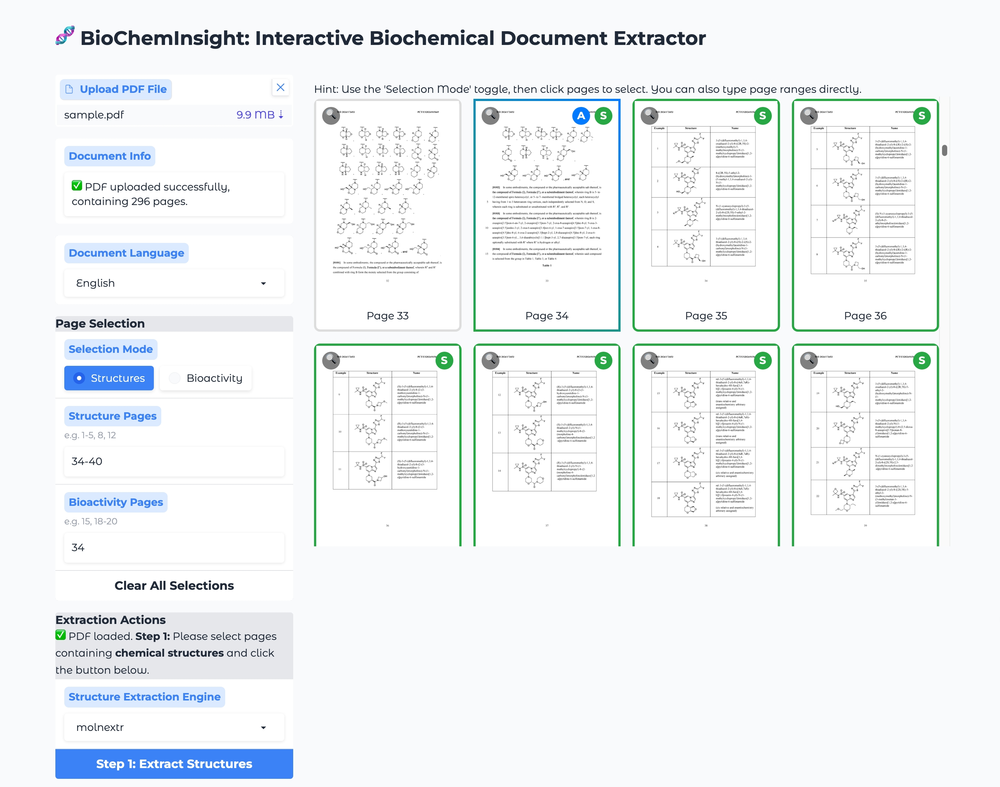

# BioChemInsight 🧪

**BioChemInsight** 是一个强大的平台，可以自动从科学文献中提取化学结构及其对应的生物活性数据。通过利用深度学习进行图像识别和OCR，它简化了为化学信息学、机器学习和药物发现研究创建高质量结构化数据集的流程。



## 功能特性 🎉

  * **自动化数据提取** 🔍: 自动从 PDF 文档中识别并提取化合物结构和生物活性数据（例如 IC50, EC50, Ki）。
  * **先进识别核心** 🧠: 采用顶尖的 DECIMER Segmentation 模型进行图像分析，并使用 PaddleOCR 进行文本识别。
  * **推荐视觉模型**: 视觉模型推荐使用 **GLM-V4.5** 或 **MiniCPM-V-4**，效果最佳。
  * **结构识别** ⚙️: 结合 DECIMER 分割与 MolNexTR，将化学图谱转换为 SMILES 字符串。
  * **自动文档规划** 📄: 自动识别结构页面、活性页面和实验名称；也可以用页面范围约束处理范围。
  * **结构化数据输出** 🛠️: 将非结构化的文本和图像转换为可直接用于分析的格式，如 CSV 和 Excel。
  * **现代化 Web UI** 🌐: 基于 React 的前端界面配合 FastAPI 后端，提供直观的 PDF 处理、实时进度跟踪和交互式结果可视化。
  * **智能数据合并** 🔗: 基于化合物 ID 自动合并结构和生物活性数据，提供无缝的集成结果。


## 应用场景 🌟

  * **AI/ML 模型训练**: 为化学信息学和生物信息学领域的预测模型生成高质量的训练数据集。
  * **药物发现**: 加速构效关系（SAR）研究和先导化合物的优化过程。
  * **自动化文献挖掘**: 大幅减少从科学文章中手动整理数据所需的人力和时间。


## 工作流程 🚀

BioChemInsight 采用多阶段流水线将原始 PDF 转换为结构化数据：

1.  **PDF 预处理**: 将输入的 PDF 拆分为单个页面，然后将这些页面转换为高分辨率图像以供分析。
2.  **结构检测**: **DECIMER Segmentation** 扫描图像，以定位和分离化学结构图。
3.  **SMILES 转换**: MolNexTR 将分离出的图谱转换为机器可读的 SMILES 字符串。
4.  **标识符识别**: 视觉模型（推荐：**GLM-V4.5**）识别与每个结构相关的化合物标识符（例如，“化合物 **1**”、“**2a**”）。
5.  **生物活性提取**: **PaddleOCR** 从识别出的活性页面提取文本，大型语言模型则辅助解析和标准化生物活性结果。
6.  **数据整合**: 所有提取的信息——化合物ID、SMILES 字符串和生物活性数据——被合并到结构化文件（CSV/Excel）中，以便下载和进行下游分析。


## 安装 🔧

#### 步骤 1: 克隆代码仓库

```bash
git clone https://github.com/dahuilangda/BioChemInsight
cd BioChemInsight
```

#### 步骤 2: 配置常量

项目需要一个 `constants.py` 文件来设置环境变量和路径。我们提供了一个模板文件。

```bash
# 重命名示例文件
mv constants_example.py constants.py
```

然后，编辑 `constants.py` 文件，设置您的 API 密钥、模型路径和其他必要配置。

#### 步骤 3: 创建并激活 Conda 环境

```bash
conda install -c conda-forge mamba
mamba create -n chem_ocr python=3.10
conda activate chem_ocr
```

#### 步骤 4: 安装依赖

首先，安装支持 CUDA 的 PyTorch。

```bash
# 安装 CUDA 工具和 PyTorch
mamba install -c nvidia -c conda-forge cudatoolkit=11.8
pip install torch torchvision --index-url https://download.pytorch.org/whl/cu118 -i https://pypi.tuna.tsinghua.edu.cn/simple
```

接下来，安装其余的 Python 包。

```bash
# 安装核心库 (使用镜像源以加快下载速度)
pip install SmilesPE opencv-python-headless -i https://pypi.tuna.tsinghua.edu.cn/simple
mamba install -c conda-forge jupyter pytesseract transformers
pip install PyMuPDF PyPDF2 openai Levenshtein mdutils tabulate python-multipart -i https://pypi.tuna.tsinghua.edu.cn/simple

# 安装 Web 服务依赖
pip install fastapi uvicorn celery redis -i https://pypi.tuna.tsinghua.edu.cn/simple

# 安装 Redis 服务端以及 Node.js/npm（用于异步 Web UI）
# 在 Ubuntu/Debian 上:
sudo apt-get install -y redis-server
curl -fsSL https://deb.nodesource.com/setup_18.x | sudo -E bash -
sudo apt-get install -y nodejs

# 在 macOS 上 (使用 homebrew):
# brew install redis node
```


## 使用方法 📖

BioChemInsight 可以通过交互式网页界面或直接从命令行操作。

> **重要提示：** 在启动流程之前，请确保 PaddleOCR 微服务正在运行，并在 `constants.py` 中配置 `PADDLEOCR_SERVER_URL`。

### 网页界面 🌐

基于 React 的现代化网页界面提供了直观的文档处理平台，具备实时进度跟踪功能。

#### 本地启动 Web 服务

Web UI 使用异步任务队列。本地开发模式下需要同时启动 **5 个进程/服务**：

1. Redis：保存任务状态、队列状态，并作为 Celery broker/result backend。
2. FastAPI 后端。
3. Queue dispatcher：把 BioChemInsight 队列中的任务派发给 Celery。
4. Celery worker：真正执行结构解析、活性解析和完整流程任务。
5. Vite 前端开发服务器。

如果不想手动管理这些进程，推荐直接使用下方的 Docker Compose 部署。

**步骤 1: 启动 Redis**

Ubuntu/Debian：

```bash
sudo systemctl start redis-server
# 或以前台开发模式启动：
redis-server
```

macOS Homebrew：

```bash
brew services start redis
# 或：
redis-server
```

默认 Redis 地址为 `redis://localhost:6379/0`。如需修改：

```bash
export REDIS_URL=redis://localhost:6379/0
export CELERY_BROKER_URL=$REDIS_URL
export CELERY_RESULT_BACKEND=$REDIS_URL
```

**步骤 2: 启动后端 API 服务器**

在项目根目录下运行：

```bash
uvicorn frontend.backend.main:app --host 0.0.0.0 --port 8000 --reload
```

**步骤 3: 启动 Queue dispatcher**

在新的终端中，从项目根目录运行：

```bash
python -m frontend.backend.queue_dispatcher
```

**步骤 4: 启动 Celery worker**

在另一个终端中，从项目根目录运行：

```bash
celery -A frontend.backend.celery_app.celery_app worker \
  -Q compute \
  --pool threads \
  --concurrency 2 \
  --prefetch-multiplier 1 \
  --loglevel INFO
```

可以用环境变量调整本地并发：

```bash
export MAX_CONCURRENT_TASKS=2
export DISPATCHER_MAX_CONCURRENT_TASKS=2
export CELERY_WORKER_CONCURRENCY=2
export STRUCTURE_TASK_CONCURRENCY=2
```

**步骤 5: 启动前端开发服务器**

在新的终端中运行：

```bash
cd frontend/ui
npm install
NODE_OPTIONS="--max-old-space-size=8196" npm run dev
```

**步骤 6: 访问界面**

在网页浏览器中打开 `http://localhost:5173` 访问界面。后端 API 地址为 `http://localhost:8000`。


#### 网页界面功能

1.  **PDF 上传**: 通过直观界面上传和管理 PDF 文件。
2.  **自动提取规划**: 自动识别结构页面、活性页面和实验名称；页面缩略图和范围输入仍可用于约束处理范围。
3.  **分步处理流程**: 
    - **步骤 1**: 上传 PDF 并预览页面
    - **步骤 2**: 实时进度显示的化学结构提取
    - **步骤 3**: 基于结构约束化合物匹配的生物活性数据提取
    - **步骤 4**: 查看和下载合并结果
4.  **实时进度跟踪**: 详细状态更新的提取进度监控。
5.  **交互式结果**: 查看、编辑和下载结构化数据，集成化合物-活性匹配。
6.  **自动数据合并**: 基于化合物 ID 无缝结合结构和生物活性数据。


### 命令行界面 (CLI)

对于批处理和自动化任务，推荐使用命令行界面。

#### 自动提取（推荐）

不提供页面和实验名称参数时，BioChemInsight 会自动规划结构和活性提取。

```bash
python pipeline.py data/sample.pdf \
    --output output
```

**约束处理范围示例:**

  * **从指定页面中提取结构:**
    ```bash
    python pipeline.py data/sample.pdf --structure-pages "242-250,255,260-267" --output output
    ```
  * **提取指定活性页面和实验:**
    ```bash
    python pipeline.py data/sample.pdf --structure-pages "242-267" --assay-pages "30,35,270-272" --assay-names "IC50,FRET EC50" --output output
    ```


## 输出 📂

平台将在指定的输出目录中生成以下结构化数据文件：

  * `structures.csv`: 包含检测到的化合物标识符及其对应的 SMILES 表示。
  * `assay_data.json`: 存储提取出的原始生物活性数据。
  * `merged.csv`: 一个合并文件，将化学结构与其相关的生物活性数据整合在一起。


## Docker 部署 🐳

在容器化环境中部署 BioChemInsight 以确保一致性和可移植性。

#### 推荐方式：Docker Compose

Docker Compose 部署包含：
- `web`：FastAPI + React UI。
- `redis`：保存任务卡片和队列状态。
- `dispatcher`：任务派发服务。
- `worker`：Celery 执行器。

启动服务：

```bash
docker compose up --build -d
```

容器入口会自动检测宿主机 bind mount 目录的 owner，并用对应 UID/GID 运行应用。通常不需要设置 `APP_UID` 或 `APP_GID`；只有需要覆盖自动检测结果时才设置：

```bash
APP_UID=1000
APP_GID=1000
ZENODO_HOST=188.185.48.75
```

`ZENODO_HOST` 是可选项，只在镜像构建阶段下载 Zenodo 上的 DECIMER 分子分割权重时使用。Dockerfile 使用 `curl --resolve` 指定 `zenodo.org` 的解析 IP，不会写 `/etc/hosts`，因此兼容 BuildKit。如果当前网络可以正常解析 `zenodo.org`，可以不设置它。

启动容器前，如果宿主机 bind mount 目录不存在，先创建它们。`web` 容器入口会先以 root 短暂运行，把 `output` 和 `frontend/backend/data` 修正为自动检测到的运行 UID/GID 可写，然后再降权启动后端和前端：

```bash
mkdir -p data output frontend/backend/data
```

可以在 `docker-compose.yml` 或 Compose `.env` 文件里调节并发：

```bash
MAX_CONCURRENT_TASKS=3
DISPATCHER_MAX_CONCURRENT_TASKS=3
CELERY_WORKER_CONCURRENCY=3
STRUCTURE_TASK_CONCURRENCY=2
```

Compose 网络使用 `172.200.0.0/16`，不是 Docker 常见的 `172.17.*` bridge 网段。

Docker 镜像在安装运行时数据处理和 RDKit 依赖后会固定 `numpy==1.26.4`，并在复制项目文件前检查实际安装的 numpy 版本，避免依赖求解时悄悄升级 numpy。

启动后，访问：
- 前端界面：`http://localhost:3000`
- 后端 API：`http://localhost:8000`

查看服务和日志：

```bash
docker compose ps
docker compose logs --tail 100 web worker dispatcher redis
```

Redis 可能输出宿主机内核参数 `vm.overcommit_memory` 的 warning。服务可以在 warning 存在时运行，但长期部署建议在宿主机启用：

```bash
sudo sysctl vm.overcommit_memory=1
echo 'vm.overcommit_memory=1' | sudo tee /etc/sysctl.d/99-redis-overcommit.conf
sudo sysctl --system
docker compose restart redis
```

#### 使用 `curl` 提交任务

Docker Compose 会暴露与 Web UI 相同的 FastAPI 后端，因此可以直接用 `curl` 以 API 方式上传 PDF、提交任务、轮询状态和下载结果。

推荐方式：使用 **完整自动流程**，自动检测结构页、活性页和实验名称。

```bash
API=http://localhost:8000/api

# 1) 上传 PDF，并自动提取返回的 pdf_id。
PDF_ID=$(
  curl -s -X POST "$API/pdfs" \
    -F "file=@data/sample.pdf" \
  | python -c 'import json,sys; print(json.load(sys.stdin)["pdf_id"])'
)
echo "$PDF_ID"

# 2) 提交推荐的完整自动流程，并自动提取 task_id。
TASK_ID=$(
  curl -s -X POST "$API/tasks/full-pipeline" \
    -H "Content-Type: application/json" \
    -d "{\"pdf_id\":\"$PDF_ID\",\"structure_filter_strictness\":\"strict\",\"lang\":\"en\"}" \
  | python -c 'import json,sys; print(json.load(sys.stdin)["task_id"])'
)
echo "$TASK_ID"

# 3) 查询任务状态，直到 "status" 变成 "completed"。
curl -s "$API/tasks/$TASK_ID" | python -m json.tool

# 4) 下载结果 CSV。
curl -L "$API/tasks/$TASK_ID/download" -o result.csv
```

高级用法：也可以分开提交结构解析和活性解析任务。

```bash
API=http://localhost:8000/api

# 结构解析：指定页面。
# 若不传 pages 或设置 auto_detect_pages=true，则自动检测结构页。
STRUCTURE_TASK_ID=$(
  curl -s -X POST "$API/tasks/structures" \
    -H "Content-Type: application/json" \
    -d "{\"pdf_id\":\"$PDF_ID\",\"pages\":\"1,3,5-7\",\"structure_filter_strictness\":\"strict\"}" \
  | python -c 'import json,sys; print(json.load(sys.stdin)["task_id"])'
)

# 活性解析：可传入已完成的结构任务 ID，用结构中的化合物列表约束匹配。
ASSAY_TASK_ID=$(
  curl -s -X POST "$API/tasks/assays" \
    -H "Content-Type: application/json" \
    -d "{\"pdf_id\":\"$PDF_ID\",\"pages\":\"10-12\",\"assay_names\":[\"IC50\",\"EC50\"],\"structure_task_id\":\"$STRUCTURE_TASK_ID\",\"lang\":\"en\"}" \
  | python -c 'import json,sys; print(json.load(sys.stdin)["task_id"])'
)

# 如需取消排队中或运行中的任务。
curl -s -X POST "$API/tasks/$ASSAY_TASK_ID/cancel" | python -m json.tool
```

#### 在 Docker 中运行命令行流程

如果您需要使用命令行执行批处理任务，请在 `docker run` 命令后指定 `python pipeline.py` 和相关参数来覆盖默认入口点。

```bash
docker run --rm --gpus all \
    -e http_proxy="" \
    -e https_proxy="" \
    -v $(pwd)/data:/app/data \
    -v $(pwd)/output:/app/output \
    --entrypoint python \
    biocheminsight \
    pipeline.py data/sample.pdf \
    --output output
```

#### 进入容器进行交互式会话

如果需要在容器内进行调试或手动运行命令：

```bash
docker run --gpus all -it --rm \
  --entrypoint /bin/bash \
  -e http_proxy="" \
  -e https_proxy="" \
  -v $(pwd)/data:/app/data \
  -v $(pwd)/output:/app/output \
  --name biocheminsight_container \
  biocheminsight
```
